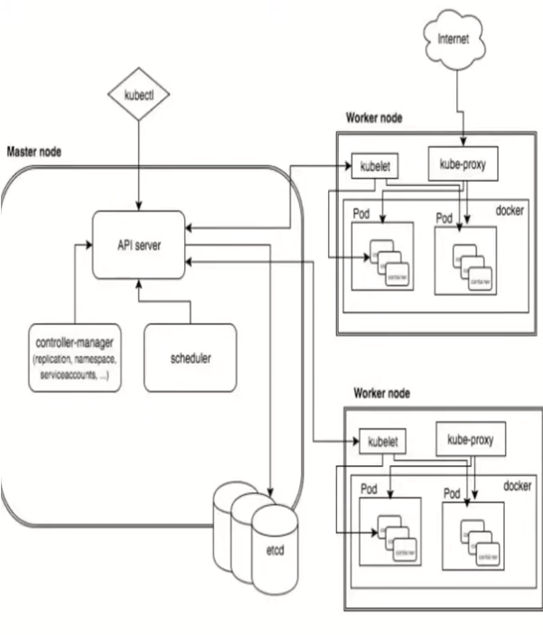
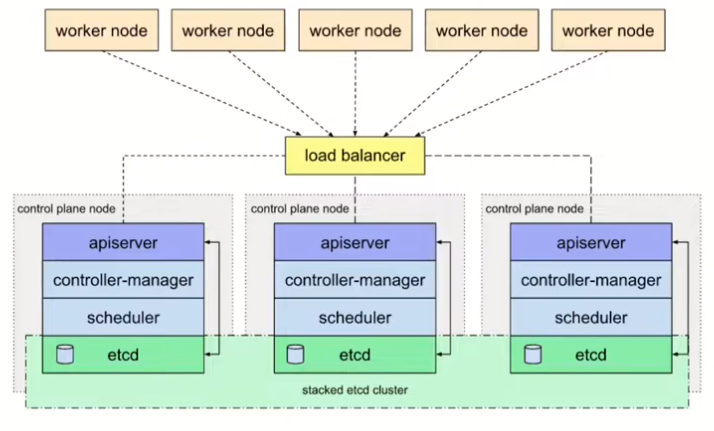
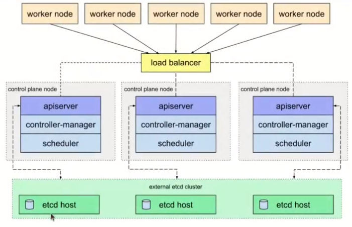

# Các thành phần trong K8s

## Master

- API server
- Controller manager
- cloud controller manager
- Scheduler
- Etcd

## Worker

- Kubelet
- Kube-proxy

# Mô hình triển khai

## Stacked etcd

- Tất cả các thành phần sẽ nằm hết trên 1 node master
- Các worker node kết nối tới server thông qua load balancer, từ đó kết nối tới các node.
- Nếu 1 node gặp lỗi thì cụm vẫn hoạt động bình thường, request sẽ được chuyển tới 1 node khác còn hoạt động

## External Etcd

- Tương tự với stacked etcd, chỉ khác là phần etcd cluster sẽ không nằm chung trên node master

# Các bước triển khai Kubernetes CLuster với Kubeadm
- Cài đặt container runtime
- Cài đặt các công cụ kubeadm, kubelet, kubestl
- Cấu hình Cgroup drive
- Cấu hình loadbalancer cho apisever
- Khởi tạo Kubernetes Cluster
- Cài đặt CNI
- Thêm master node, worker node
