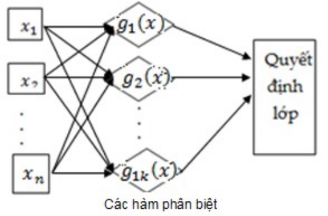
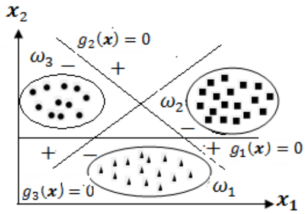
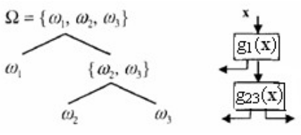
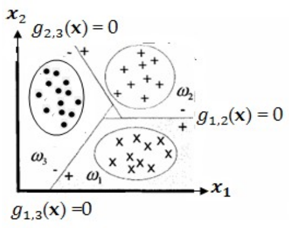
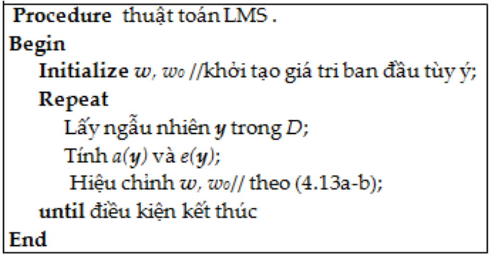

Đề cương ôn tập

---

# 1. Phát biểu bài toán nhận dạng mẫu có giám sát và cho biết cách tìm hàm hồi quy nhờ xác định tham số. Nếu tập có 100 mẫu và có thể nhận 5 nhãn thì có thể có bao nhiêu giả thuyết?

## Phát biểu bài toán nhận dạng mẫu có giám sát

- Học có giám sát (supervised learning) dùng để chỉ các bài toán học mà trong dữ liệu/kinh nghiệm hay quá trình học có các thông tin định hướng để cải thiện độ đo thực hiện.
- Hai bài toán học có giám sát thường gặp nhất là **phân lớp** và **hồi quy hàm số** dựa trên một tập mẫu đã biết nhãn.
- Cho một tập mẫu quan sát được $D=\{x^k, y^k\}, k \in \{1, ..., N\}$, trong đó $D_x = \{x^k\}$ là tập con của tập đối tượng X còn $D_y=\{y^k\}$ là nhãn trong tập Y của các đối tượng tương ứng. Ta cần tìm nhãn cho các đối tượng x mới trong X.

## Cách tìm hàm hồi quy nhờ xác định tham số

Phương pháp thông dụng giải bài toán hồi quy là tìm hàm hồi quy g có biểu diễn tham số như sau:
$$g(x) = \varphi(x, c_1, ..., c_M)$$

Việc xác định các hệ số $c_k$ được thực hiện nhờ tìm cực tiểu tổng bình phương sai số (sum of squared errors - SSE):
$$E(c) = \sum_{k=1}^{N} [\varphi(x^k)-y^k]^2$$

Với bài toán nội suy thì cực tiểu của E tìm được sẽ bằng 0. Trường hợp tổng quát, véc-tơ c có thể tìm bằng thuật toán gradient hoặc biến thể của nó. Một biến thể đơn giản nhất được mô tả như sau:

1. Khởi tạo $c=c^0\in^M$ tùy ý
2. Thực hiện lặp:
   - 2.1. Tính $E'(c^0) = \left[\frac{\partial E}{\partial c_1}, ..., \frac{\partial E}{\partial c_m}\right]^T$;
   - 2.2. $\alpha_1=\alpha$ // $\alpha\in(0,1]$ cho trước
   - 2.3. $c^1=c^0-\alpha_1E'(c^0)$;
   - 2.4. Nếu $E(c^1) < E(c^0)$ thì $c^0 \leftarrow c^1$ và quay lại 2.1;
   - 2.5. Ngược lại: $\alpha_1 \leftarrow \frac{\alpha_1}{2}$ và trở lại 2.3

Thuật toán dừng khi $||E'(c^1)||$ đủ bé, trong đó $||u||=\sqrt{\sum_{i=1}^{M} u_i^2}$ là chuẩn Euclide của véc-tơ u trong $R^M$.

Trong trường hợp tuyến tính, ta giải hệ phương trình đạo hàm bằng 0 để tìm ra cực trị của hàm.

## Nếu tập có 100 mẫu và có thể nhận 5 nhãn thì có thể có bao nhiêu giả thuyết?

Có $5^{100}$ giả thuyết

---

# 2. Giới thiệu các phương pháp tìm hàm hồi quy mà anh/ chị biết.

Các phương pháp tìm hàm hồi quy:

- Giải hệ phương trình trong trường hợp tuyến tính
- Phương pháp tối ưu (gradient)

---

# 3. Trình bày phương pháp trực tiếp hàm hồi quy và áp dụng cho hàm hồi quy dạng tuyến tính.

Trong trường hợp tuyến tính, ta giải hệ phương trình đạo hàm bằng 0 để tìm ra cực trị của hàm.

---

# 4. Trình bày khái niệm cây quyết định và thuật toán ID3. So sánh các thuật toán ID3 và C4.5

## Lược đồ chung xây dựng cây quyết định

Xây dựng lược đồ cây quyết định thực hiện đệ quy giống nhau như sau:

1. Mở một nút gốc, nếu dữ liệu thuần nhất hoặc hết thuộc tính thì gán nhãn chung hoặc nhãn đa số và nút và làm nút lá
2. Chọn thuộc tính tốt nhất gán cho nút và phát triển các nhãn theo giá trị thuộc tính này cùng với xác định các tập con dữ liệu tương ứng với giá trị được xét
3. Trở lại bước 1 cho đến khi mọi nút lá được xác định

## Thuật toán ID3

ID3(Tập mẫu, tập nhãn, tập thuộc tính) 0. Khởi tạo: D, tập nhãn, tập thuộc tính;

1. Tạo nút gốc cho cây;
2. Gán nhãn cho nút nếu dữ liệu thuần nhất hoặc tập thuộc tính là rỗng
   1. Nếu mọi mẫu đều dương tính/âm tính thì nhãn nút gốc là +/-
   2. Nếu tập các thuộc tính là rỗng, trả về cây 1 nút gốc có nhãn là giá trị phổ biến của thuộc tính đích trong tập các mẫu
   3. Các trường hợp khác sang bước 3
3. Gồm các bước:
   1. Xác định thuộc tính phân loại tập mẫu tốt nhất trong tập thuộc tính
   2. A $\leftarrow$ thuộc tính phân lớp tốt nhất
   3. Với mỗi giá trị có thể $v_i$ của thuộc tính A, thực hiện:
      1. THêm 1 nhánh mới dưới nút gốc với mỗi điều kiện $A=v_i$
      2. Xác định $Example_{v_i}=\{x \in \text{tập mẫu}: x \text{ có giá trị vì ở thuộc tính } A\}$
      3. Nếu $Example_{v_i}$ là rỗng thì thêm dưới nhánh 1 nút lá có nhãn là nhãn phổ biến nhất của các mẫu trong tập mẫu
      4. Ngược lại, trở lại bước 1 với khơi tạo:
         $$D = \text{Examples}, \text{tập nhãn}, \text{tập thuộc tính} - \{A\}$$

## So sánh thuật toán ID3 và thuật toán C4.5

Thuật toán C4.5 được đề xuất để khắc phục các nhược điểm có trong ID3

1. Ngoài áp dụng tiêu chuẩn _Thu hoạch thông tin cực đại_, C4.5 còn đề xuất sử dụng tiêu chuẩn _Tỷ lệ thu hoạch thông tin cực đại (Gainratio)_ để dùng cho các trường hợp mà tiêu chuẩn trước áp dụng không tốt
2. Áp dụng các kỹ thuật chặn sớm để tránh overfit
3. Đề xuất giải pháp xử lý trường hợp mẫu có thuộc tính thiếu giá trị
4. Đề xuất phương pháp áp dụng cho thuộc tính nhận giá trị liên tục

---

# 5. Trình bày thuật toán C4.5 xây dựng cây quyết định, cách xử lý thuộc tính có giá trị liên tục và mẫu có giá trị thuộc tính bị mất so với CRAT thế nào?

## Trình bày thụât toán C4.5

Thuật toán C4.5 được đề xuất đề khắc phục các nhược điểm của ID3, gồm các cải tiến như sau:

1. Ngoài việc áp dụng tiêu chuẩn _Thu hoạch thông tin cực đại_, C4.5 còn đề xuất sử dụng tiêu chuẩn _Tỷ lệ thu hoạch thông tin cực đại (Gainratio)_ để dùng cho các trường hợp mà tiêu chuẩn trước áp dụng không tốt
2. Áp dụng kỹ thuật chặn sớm để tránh overfit
3. Đề xuất giải pháp xử lý trường hợp mẫu có thuộc tính thiếu giá trị
4. Đề xuất giải pháp cho trường hợp thuộc tính nhận giá trị liên tục

### Xử lý mẫu có thuộc tính thiếu giá trị

Trong thực tế, có nhiều trường hợp dữ liệu bị thiếu ví dụ như bệnh án. Khi đó, dữ liệu bị thiếu có thể ước lượng theo 2 cách:

- Cách 1: Gán cho giá trị bị thiếu của mẫu bằng giá trị phổ biến nhất của các mẫu tại nút đang sét và cùng lớp với nó.
- Cách 2: Áp dụng cho trường hợp có nhiều mẫu bị thiếu giá trị ở cùng 1 thuộc tính. Ta có thể gán gia trị ngẫu nhiên cho tập mẫu bị thiếu này với phân bố bằng tần xuất xuất hiện của giá trị tương ứng trong tập mẫu tại nút đang xét. Ví dụ: thuộc tính A giá trị boolean và nếu nút đang xét chứa 70 mẫu đã biết với giá trị thuộc tính này bằng 1 và 30 mẫu đã biết có giá trị thuộc tính này là 0. Khi đó, ta tước lượng xác suất đề A(x)=1 là 0.7 và A(x)=0 là 0.3. Bằng cách này, các mẫu thiếu giá trị thuộc tính này ở nút đang xét được tạo ra với tỷ lệ khoảng 0.7 xuống nhánh ứng với thuộc tính A=1 còn với tỷ lệ khoảng 0.3 xuống nhánh thuộc tính A=0 của cây và dùng chúng để tính thu hoạch thông tin cho bước phát triển.

### Xử lý thuộc tính có giá trị liên tục

Giả sử dữ liệu có thuộc tính A có giá trị liên tục. Trong tập mẫu quan sát được có các mẫu nhận các giá trị được xếp thứ tự tăng dần là $a_1, a_2, ..., a_n$, thuật toán xử lý như sau:

- Đối với mỗi giá trị $a_i$, chia tập mẫu thành 2 lớp để tính thu hoạch thông tin:
  - Lớp 1: tập mẫu có giá trị thuộc tính A nhỏ hơn hoặc bằng $a_i$
  - Lớp 2: tập mẫu còn lại
- Điểm chia nhãnh $a_k$ là điểm cho _Thu hoạch thông tin_ / _Tỷ lệ thu hoạch thông tin_ là cực đại

### Khắc phục hiện tượng overfit

**Tỉa bớt để giảm lỗi**

- Khi phát triển một nút mới cần dựa vào kết quả thống kê trên tập kiểm tra để đánh giá có nên phát triển tiếp hay biến nó thành nút lá.
- Trong thực tế, người ta thường áp dụng tỉa cây sau khi đã học xong. Theo cách tiếp cận này, tập dữ liệu quan sát được chia thành 3 tập: train, validation, test. Ban đầu, người ta dùng tập train và tập validation để xây dựng cây theo phương thức chặn sớm để có 1 cây với lỗi kiểm tra nhỏ nhất. Sau đó người ta dùng tập test để cắt bỏ các cành con nhằm giảm lỗi trên tập này.
- Khi muốn tỉa 1 cảnh/cây con từ 1 nút nghi vấn, người ta gán nhãn phổ biến nhất của tập dữ liệu đào tạo phù hợp với nó, nếu cây mới thu được có lỗi thấp hơn trên tập test thì cành/cây con này được tỉa và nút này trở thành nút lá. Trong trường hợp lỗi đánh giá không giảm thì giữ nguyên cây con trên cây.
- Quá trình tỉa tiếp tục tới khi nó làm giảm độ chính xác của cây trên tập test.

**Lược sau luật**

1. Xây dựng cây quyết định từ tập train cho đến khi dữ liệu huấn luyện phù hợp nhiều nhất đến mức có thể và cho phép xuất hiện overfit
2. Chuyển đổi cây sang tập các luật (Nếu ... thì ...) tương đương bằng cách tạo ra 1 luật cho mỗi đường đi từ gốc đến lá
3. Đơn giản mỗi luật bằng cách bỏ ra bất kỳ tiền điều kiện nào dẫn đến sự cải thiện độ chính xác của nó.
4. Sắp xếp các luật đã được lược bớt theo độ chính xác của nó và xem xét chúng trong chuỗi này trong các trường hợp phân loại sau đó.

### Tiêu chuẩn chọn thuộc tính

- Ta có thể thấy, 1 thuộc tính nhận quá nhiều giá trị thì lượng _Thu hoạch thông tin_ của nó thường lớn nhưng lại không mang nhiều ý nghĩa. Ví dụ như ID của mỗi bản ghi. Do đó C4.5 sử dụng tỷ lệ thu hoạch (Gain Ratio) thay cho Information Gain
- Tỷ lệ thu hoạch này phạt các thuộc tính có nhiều giá trị bằng cách thêm vào 1 hạng tử gọi là Split Information, đại lượng này nhạy cảm với việc đánh giá tính rộng và đồng nhất khi chia tách dữ liệu theo giá trị thuộc tính:
  $$SplitInfomation(S, A) = - \sum_{i=1}^{k}\frac{|S_i|}{|S|}log_2 \frac{|S_i|}{|S|}$$
- Trong đó, $S_1$ đến $S_k$ là kà tập con của các mẫu huấn luyện khi phân chia S theo k giá trị của thuộc tính A. Khi đó GainRatio của tập S đối với thuộc tính A được xác định như sau:
  $$GainRatio(S, A) = \frac{Gain(S, A)}{SplitInformation(S,A)}$$
- Khi sử dụng GainRatio thay cho InformationGain, có thể xuất hiện SplitInformation(S,A) = 0 hoặc rất nhỏ khi $|S_i| \approx |S|$. Vì vậy, khi áp dụng ta thường kế hợp 2 tiêu chuẩn: (1) tính InformationGain cho mỗi thuộc tính, sau đó áp dụng GainRatio cho các thuộc tính có InformationGain trên trung bình để chọn thuộc tính tốt nhất.

## Xử lý thuộc tính có giá trị liên tục so với CART

CART là 1 cách tiếp cận khác, xây dựng cây quyết định nhị phân dựa vào tiêu chuẩn thuần nhất Gini để chọn thuộc tính ưu tiên và rẽ nhánh. Cách xây dựng cây tương tự ID3, chỉ khác ở cách chọn thuộc tính kiểm tra và cách rẽ nhánh ở mỗi nút.

### Độ thuần nhất Gini

Chỉ số Gini đo độ không đồng nhất của 1 tập dữ liệu D bằng công thức:
$$Gini(D) = 1-\sum_{i=1}^{m}p_i^2$$
Trong đó, $p_i^2$ là tần suất mẫu có nhãn $y_i$ trong tập D

**Thuộc tính ưu tiên và quy tắc chia**

- Chỉ số Gini quan tâm đến trường hợp ta sử dụng 1 thuộc tính và chia dữ liệu thành 2 nửa. Ta xét trường hợp thuộc tính A có v giá trị khác nhau xuất hiện trong tập D. Để xác định cách phân chia tốt nhất, ta xét toàn bộ các tập con của D phân chia theo các giá trị của A. Do đó, nếu A có v giá trị khác nhau thì ta sẽ có $2^v$ tập con của D.
- Ví dụ thuộc tính income có 3 giá trị {low, medium, high} thì các tập con có thể là {low, medium}, {low, high}, ... Ta không xét tập rỗng và tập có cả 3 giá trị vì nó không phân chia thông tin.
- Khi tập D được chia thành 2 nửa, ta xem xét độ không đồng nhất của dữ liệu trong 2 nửa này:
  $$Gini_A(D) = \frac{|D_1|}{|D|}Gini(D_1) + \frac{|D_2|}{|D|}Gini(D2)$$
- Khi đó, ta xác định độ giảm của độ bất đồng nhất dữ liệu khi chia dữ liệu thành 2 tập con theo thuộc tính A:
  $$\Delta Gini(A) = Gini(D) - Gini_A(D)$$
- Do đó, cách phân chia nào mà tạo ra 2 tập con có giá trị $\Delta Gini(A)$ lớn nhất sẽ được chọn.

---

# 6. Anh/chị hiểu thế nào là hiện tượng phù hợp trội? Cho biết các cách khắc phục hiện tượng này khi dùng phương pháp cây quyết định để xây dựng bộ học.

## Hiện tượng phù hợp trội (overfit)

Cho 1 không gian giả thuyết H, ta nói 1 giả thuyết $h\in H$ là overfit với dữ liệu huấn luyện nếu tồn tại 1 giả thuyết $h' \in H$ mà h có sự sai lệch ít hơn h' trên tập huấn luyện nhưng h' lại ít sai lệch hơn h trên toàn bộ tập mẫu có thể gặp

## Các khắc phụ overfit trên cây quyết định

- Tỉa cây
- Lược sau luật

---

# 9. Cho biết các bài toán thích hợp với học bằng cây quyết định

## Cần bổ sung

# 10. Giải thích khái niệm miền và biên quyết định, trình bày thuật toán học Perceptron

## Miền quyết định và biên quyết định

- Trong các bài toán phân lớp mẫu, mỗi mẫu x trong tập đối tượng X thường được biểu diễn bởi n đặc trưng: $x=(x_1, ..., x_n)$. Để phân X thành k lớp $\{\omega_1, ..., \omega_n\}$, người ta thường dùng **k hàm phân biệt** hay còn gọi là **hàm quyết định**: $g_i(x)~~~~i=1, ..., k$, mỗi hàm xác định 1 lớp. Mỗi đối tượng có véc-tơ đặc trưng x được gán cho lớp $\omega_i$ nếu giá trị hàm phân biệt $g_i(x)$ lớn nhất, tức là:
  $$x \in \omega_i \text{ nếu } g_i(x) > g_j(x) \forall i \neq j$$
- Bằng cách này, bộ phân lớp được xem như một mạng hay một máy dùng để tính k hàm phân biệt và chọn lớp ứng với giá trị hàm phân biệt lớn nhất để gán cho mỗi đối tượng như được minh họa trong hình sau
  
- Trong trường hợp các đặc trưng nhận giá trị thực, các hàm phân biệt chia không gian thành k miền $\{R_i\}_{i=1}^k$, mỗi miền $R_i$ xác định một lớp:
  $$
  R_i = \left\{ \mathbf{x} \in X : g_i(\mathbf{x}) = \max \left\{ g_j(\mathbf{x}) \mid \forall j \leq k \right\} \right\}
  $$
- được gọi là **miền quyết định** của lớp $\omega_i$ của lớp $\omega_i$ tương ứng. Khi đó, quy tắc quyết định là: x thuộc $R_i$(được gán vào lớp $\omega_i$ nếu $g_i(x) > g_j(x) \forall i \neq j$)
- Các miền quyết định này được tách biệt bởi **biên quyết định**, chúng là hợp của các phần mặt phẳng/siêu phẳng trong không gian đặc trưng chứa các điểm có giá trị hàm phân biệt lớn nhất bằng với giá trị của ít nhất 1 hàm phân biệt khác. Các biên quyết định tách các lớp trong không gian đặc trưng.

## Thuật toán học Perceptron

- Xét bài toán có 2 lớp $\omega_1$, $\omega_2$, gồm n đặc trưng. Quan sát được $D=D_1 \cup D_2$, $D_i$ là các mẫu thuộc lớp $\omega_i$.
- Cần tìm véc-tơ w và hệ số $w_0$ sao cho:
  $$g(x) = w'x + w_0 > 0 \forall x \in D_1 \text{ và } g(x) < 0 \forall x \in D_2$$
- Định nghĩa 2 hàm hardlim : $R \rightarrow R$ và t: $D \rightarrow R$ như sau:
<pre>
hardlim(x) = {
  1,  if x ≥ 0
  0,  if x < 0
}
</pre>

---

# 12. Giải thích ý nghĩa các khái niệm tách tuyệt đối và tách theo cặp khi các lớp tách được tuyến tính, trình bày thuật toán Widrow-Hoff

## Khái niệm tách tuyệt đối và tách theo cặp khi các lớp tách được tuyến tính

Thông thường, các mẫu trong mỗi lớp được đặc trưng bởi 1 phân bố ngẫu nhiên. Trong hình sau, các elip biểu diễn **biên** của phân phối và còn được gọi là **giới hạn lớp**

**Tách tuyệt đối**

- Là khi mỗi lớp được tách hẳn ra khói các lớp còn lại, ta nói tập mẫu tách được tuyệt đối.
- Khi các lớp tách được tuyệt đối thì hệ nhận dạng sẽ có cấu trúc phân cấp mô tả bởi cây quyết định nhị phân như mình họa sau, trong đó $g_{23}(x) = g_2(s) - g_3(x)$ để tách lớp $\omega_1$ với $\omega_2$
  

**Tách theo cặp**

- Có những trường hợp tập mẫu không tách được tuyệt đối nhưng có thể tách theo từng cặp như minh họa trong hình sau
  
- Các trường hợp này không thể mô tả được bằng cây quyết định. Trường hợp này, người ta xác định $\frac{k(k-1)}{2}$ siêu phẳng tách từng cặp lớp nhờ dùng các hàm phân biệt thỏa mãn:
  $$g_{ij}(x) > 0 \forall x \in \omega_i \text{ và } g_{ij}(x) < 0 \forall x \in \omega_j$$
- Miền quyết định lúc này là: $R_i = \{x; ~g_{ij}(x) > 0, ~i,j=1, ..., k\}$
- Để xây dựng các bộ phân lớp, ta dùng các thuật toán tìm véc-tơ w và hệ số $w_0$ của hàm phân biệt: $g_i(x) = \omega^Tx + \omega_0$

## Trình bày thuật toán Widrow-Hoff (Bình phương tối thiểu - LMS)

- Ta xét bài toán với tập quan sát $D={x^i} ~ i=1, ..., N$ với nhãn $t(x^i)$ tương ứng, $a(x) = \sum_{i=1}^{N} w_i x_i + w_0$
- Quy tắc phân lớp sẽ là: $x \in \omega_1$ nếu a(x) > 0 và $x \in \omega_2$ nếu a(x) < 0
- Tập mẫu này không đảm bảo sẽ hội tụ khi sử dụng học perceptron.

**Sai số trung bình phương**

- Với tập D, véc-tơ $w$ và $w_0$ đã cho, sai số trung bình phương của bộ phân lớp là: $E = E(S, w, w_0) = [t(x^i) - a(x^i)]^2$. Trong đó, t(x) là nhãn thật, a(x) là nhãn được mô hình dự đoán.
- Khi x lấy ngãu nhiên cùng phân bố với D trong không gian đặc trưng thì $E(D, w, w_0)$ là xấp xỉ của kỳ vọng bình phương sai số:
  $$E[t(x^i) - a(x^i)]^2$$
- Mục tiêu là tìm $w$ và $w_0$ sao cho E đạt cực tiểu
- Bài toán tìm cực tiểu E luôn có nghiệm (mục 2.4, chương 2), có thể tìm nghiệm nhờ giải hệ phương tình:
  $$\frac{\partial E}{\partial w_k}=0 ~~~~ \text{với k=0, ..., n}$$
- Khi N lớn, việc giải hệ phương tình này có sai số lớn và độ phức tạp $O(N^3)$ nên khó thực hiện.
- Widrow và Hoff đề xuất dùng phương pháp gradient để tìm các $w_k$

**Thuật toán Widrow-Hoff**

1. Khởi tạo ngẫu nhiên $w$ và $w_0$
2. Thực hiện lặp theo k. Lấy ngẫu nhiên $y^k$ trong D và hiệu chỉnh trọng số:
   - $w^{mới}=w^{cũ} + 2^\alpha e(y^k)y^k$
   - $w_0^{mới}=w_0^{cũ} + 2^\alpha e(y^k)$
   - $\alpha$ là tốc độ học $0<\alpha < \frac{1}{\lambda_{max}}$ với \lambda\_{max} là giá trị riêng lớn nhất của ma trận tương quan mẫu:
3. Điều kiện kết thúc có thể là số lần lặp hoặc độ lệch của sai số trung bình phương nhỏ hơn cho trước.
   

---

# 13. Thành phần chính là gì? cho biết ý nghĩa của phân tích thành phần chính.

## Thành phần chính là gì ?

- Thành phần chính là các biến đổi tuyến tính của đặc trưng gốc nên khi giảm chiều có thể làm mất thông tin phi tuyến trong dữ liệu.

Bổ sung thêm

---

# 14. Anh (chị) biết những phương pháp nào để giảm chiều dữ liệu, cho biết ưu nhược điểm của từng phương pháp.

Bổ sung

---

# 15. Trình bày phương pháp tìm phân biệt tuyến tính nhờ khoảng cách cực tiểu với khoảng cách Euclid

## Phân lớp khoảng cách cực tiểu

- Xét trường hợp đối tượng là dữ liệu trộn của k lớp với trung bình mẫu tương ứng là tập véc-tơ $m_i$. Khi đó có thể dùng hàm phân biệt: $g_i(x)=-d(x, m_i)$.
- Trong đó, $d(x, y)$ là khoảng cách xác định bởi metric chọn trước. Theo phương pháp này, sau khi tính trung bình mẫu của mỗi lớp, ta lấy chúng là tâm lớp và mỗi đối tượng sẽ được xếp vào lớp mà nó gần tâm nhất.

## Phân biệt tuyến tính Euclide

Quy tắc quyết định là: 
$$x \in \omega_i \text{ nếu } -||x - m_i|| > -||x-m_j||~~ \forall ~ j \neq i$$

$$\iff ||x||^2 + ||m_i||^2 - 2m_i^{'} > ||x||^2 + ||m_j||^2 - 2m_j^{'}x $$
