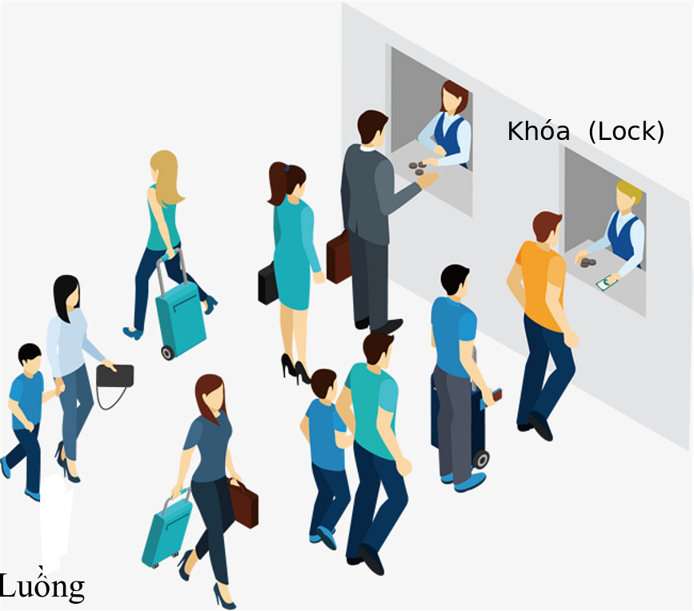

# Python GIL là gì?
- Python Global Interpreter Lock (GIL) là một thuật ngữ trong lập trình có liên quan đến xử lý Luồng (Thread), một khóa toàn cục quản lý luồng sao cho tại một thời điểm nhất định, chỉ có 1 Luồng giữ khóa đóng vai trò truy xuất, chỉnh sửa bộ nhớ. 
- Cơ chế của GIL được mô tả như hình bên dưới. Thử tưởng tượng hình bên dưới mô tả quá trình phân phối tài nguyên CPU trong Python, trong đó mỗi cá nhân xếp hàng là 1 Luồng, người thu ngân đóng vai trò là Khóa (và rõ ràng, chúng ta đang có 2 Process chạy song song). Tại mỗi thời điểm mỗi Khóa chỉ làm việc với 1 Luồng, khi đó chúng ta coi Luồng đó đang giữ Khóa, các Luồng còn lại phải ở trong trạng thái Chờ-Queue.

    

