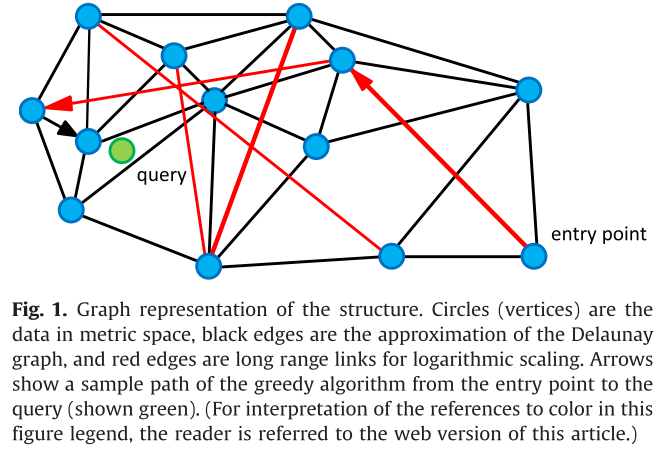
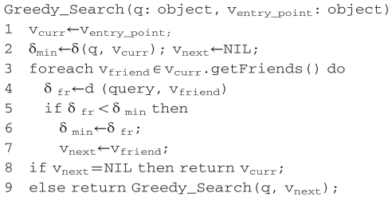
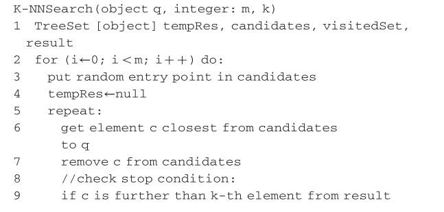
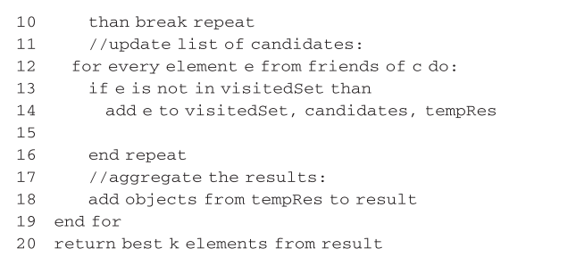

[Approximate nearest neighbor algorithm based on navigable small world graphs](2014ISApproximatenearestneighboralgorithmbasedonnavigable.pdf)
***
# Related work
- [Kd-tree](kd-tree.pdf) and [quadra trees](quad-trees.pdf) were among the first works on the kNN problem. These algorithms perform well in 2-3 dimensions (search complexity is $O(log n)$) but [the analysis](Worst_case_analysis_for_region_and_parti.pdf) of the worst case is $O(d*N^{1-1/d})$ 
- In general, currently there are no methods for effective exact NNS in high-dimensionality metric spaces. The reason behind this lies in [the "cusrse" of dimentionality](searching-in-metric-space.pdf). To avoid the curse of dimensionality while retaining the logarithmic cost on the number of elements, it was proposed to reduce the requirements for the kNN problem
solution, making it approximate (Approximate kNN).
- There are two commonly used definitions of the approximate neightbor search:
    1. **Searching with predefined accuracy $\epsilon (\epsilon-NNS)$**: the distance between the query and any element in the result is no more than $1+\epsilon$ times the distance from query to its true k-th nearest neighbors.
    2. **Giving probability guarantee of finding true k closest point to the query**: using "recall" (the fraction of true k nearest elements found)
- [Kleinberg's work](small-world.pdf) has shown the possibility of using navigable small world networks for finding the nearest neighbor with the greedy search algorithm.

# Core idea
- The structure $S$ is constructed as a navigable small world network represented by a graph $G(V, E)$, where ofbjects from the set $X$ are uniquely mapped to vertices from the set $V$. The set of edges $E$ is determined by the structure construction algorithm.
- The authors use a variation of the greedy search algorithm as as base algorithm for the k-nn search. It traverses the graph from an element to another element each time selecting an unvisited friend closest to the query until it reaches a stop condition.
- It is important to note that links in the grpah serve 2 distinct purposes:
    - There is a subset of short-range links, which are used as an approximation of [the Delauney graph](voronoi-diagrams.pdf) required by the greedy search algorithm.
    - Another subset is the long-range links, which are used for logarithmic scaling of the greedy search. [Long-range links are responsible for the navigation small world properties of the constructed graph](small-world.pdf)
- The construction of the structure is based on the consecutive insertion of all elements. For every new incoming element, the algorithm finds the set of its closest neighbors (Delaunay graph approximation) from the structure. As more and more elements are inserted into the structure, links that previously served as short-range links now become long-range links making a navigable small world.
- All queries in the structure are independent; they can be done in parallel, distributed.

# Search algorithm
## Basic greedy search algorithm

## k-NN search modification
- [In authors's previous work](Sisap2012-ScalableDistributedAlgorithmforApproximateNearest.pdf), they have used a simple algorithm for k-NN search based onf a series of $m$ searches and returns the best results of these.
- In this work, they presented a more sophisticated version of the k-NN algorithm with 2 key modifications:
    1. **Adding different stop condition**: The algorithm iterates on not previously visited elements closest to the queries. It stops when at the next iteration, $k$ closest results to the query do not change. Simply put, the algorithm keeps exploring the neighborhood of the closest elements in a greedy manner as long as it can improve the known $k$ closest elements on each step.
    2. **Adding global visitedSet variable**: The list of previously visited elements $visitedSet$ is shared across the series of searches preventing useless repeated extractions.p

# Data insertion algorithm