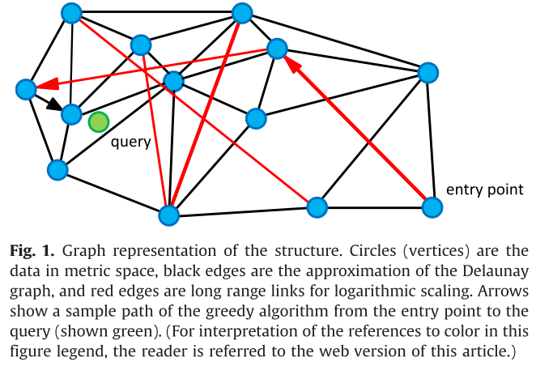
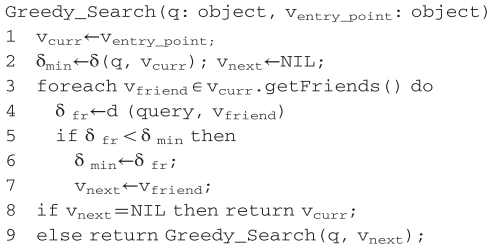
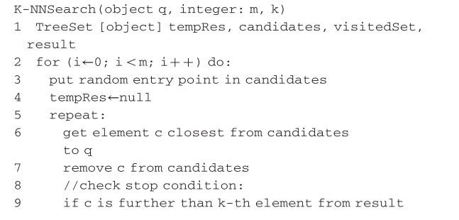
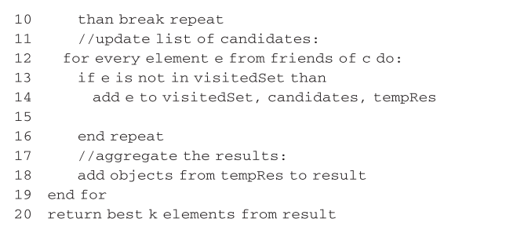
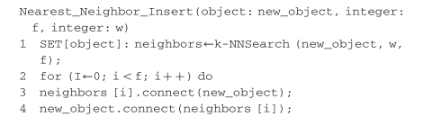
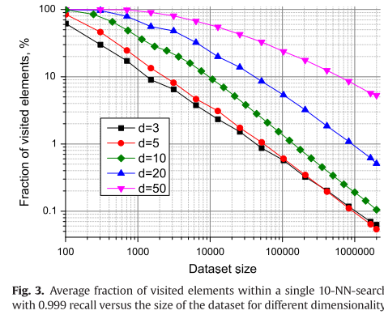
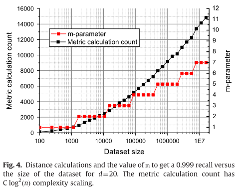
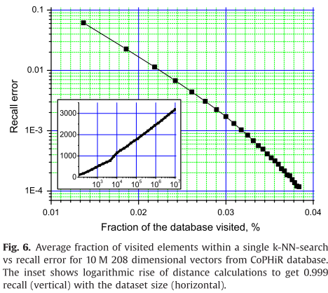
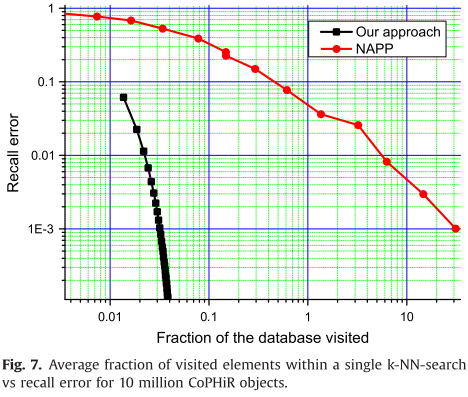

[Approximate nearest neighbor algorithm based on navigable small world graphs](2014ISApproximatenearestneighboralgorithmbasedonnavigable.pdf)
***

# 1. Related work
- [Kd-tree](related_papers/kd-tree.pdf) and [quadra trees](related_papers/quad-trees.pdf) were among the first works on the kNN problem. These algorithms perform well in 2-3 dimensions (search complexity is $O(log n)$) but [the analysis](related_papers/Worst_case_analysis_for_region_and_parti.pdf) of the worst case is $O(d*N^{1-1/d})$ 
- In general, currently there are no methods for effective exact NNS in high-dimensionality metric spaces. The reason behind this lies in [the "cusrse" of dimentionality](related_papers/searching-in-metric-space.pdf). To avoid the curse of dimensionality while retaining the logarithmic cost on the number of elements, it was proposed to reduce the requirements for the kNN problem
solution, making it approximate (Approximate kNN).
- There are two commonly used definitions of the approximate neightbor search:
    1. **Searching with predefined accuracy $\epsilon (\epsilon-NNS)$**: the distance between the query and any element in the result is no more than $1+\epsilon$ times the distance from query to its true k-th nearest neighbors.
    2. **Giving probability guarantee of finding true k closest point to the query**: using "recall" (the fraction of true k nearest elements found)
- [Kleinberg's work](related_papers/small-world.pdf) has shown the possibility of using navigable small world networks for finding the nearest neighbor with the greedy search algorithm.

# 2. Core idea
- The structure $S$ is constructed as a navigable small world network represented by a graph $G(V, E)$, where ofbjects from the set $X$ are uniquely mapped to vertices from the set $V$. The set of edges $E$ is determined by the structure construction algorithm.
- The authors use a variation of the greedy search algorithm as as base algorithm for the k-nn search. It traverses the graph from an element to another element each time selecting an unvisited friend closest to the query until it reaches a stop condition.
- It is important to note that links in the grpah serve 2 distinct purposes:
    - There is a subset of short-range links, which are used as an approximation of [the Delauney graph](related_papers/voronoi-diagrams.pdf) required by the greedy search algorithm.
    - Another subset is the long-range links, which are used for logarithmic scaling of the greedy search. [Long-range links are responsible for the navigation small world properties of the constructed graph](related_papers/small-world.pdf)
- The construction of the structure is based on the consecutive insertion of all elements. For every new incoming element, the algorithm finds the set of its closest neighbors (Delaunay graph approximation) from the structure. As more and more elements are inserted into the structure, links that previously served as short-range links now become long-range links making a navigable small world.
- All queries in the structure are independent; they can be done in parallel, distributed.

# 3. Search algorithm
## 3.1. Basic greedy search algorithm

## 3.2. k-NN search modification
- [In authors's previous work](related_papers/Sisap2012-ScalableDistributedAlgorithmforApproximateNearest.pdf), they have used a simple algorithm for k-NN search based onf a series of $m$ searches and returns the best results of these.
- In this work, they presented a more sophisticated version of the k-NN algorithm with 2 key modifications:
    1. **Adding different stop condition**: The algorithm iterates on not previously visited elements closest to the queries. It stops when at the next iteration, $k$ closest results to the query do not change. Simply put, the algorithm keeps exploring the neighborhood of the closest elements in a greedy manner as long as it can improve the known $k$ closest elements on each step.
    2. **Adding global visitedSet variable**: The list of previously visited elements $visitedSet$ is shared across the series of searches preventing useless repeated extractions.p

# 4. Data insertion algorithm
- Insert elements one by one and connect them on each step with the $f$ closest objects which are already in the structure.
- The idea based on that intersection of the set of elements which are Voronoi neighbors and the $f$ closest elements should be large
- To determine the set of $f$ closest elements, the authors use [approximate kNN search algorithm](#k-nn-search-modification)

## 4.1. Choice of parameters
- The idea is to set $w$ big enough to have the recall close to [0.95 - 0.99]. 
- The [tests](related_papers/Sisap2012-ScalableDistributedAlgorithmforApproximateNearest.pdf) indicate that for Euclid data with d=1...20, the optimal value for number of neighbors to connect ($f$) is about 3d, making memory consumption linear with the dimensionality. Lesser values of $f$ can be used to reduce the complexity of a single search, sacrificing its recall quality.

# 5. Test results and disscussion
## 5.1. Test data
The author used the following test datasets:
- Uniformly distributed random points with $L_2$ (Euclidean distance) distance function (up to $5\times10^7$ elements, up to 50 dimensions)
- A subset of the [CoPHiR](related_papers/CoPHiR.pdf) for comparison with other works. 208-dimensional feature vectors were extracted from the database. $L_1$-dimensional was used as a distance function. 30 approximate nearest neighbors are found during a search.

## 5.2. k-Nearest neighbor search complexity scaling
Measuring on recall: the ratio between relavent results and the objects obtained by the approximate search. 
- The author calculate recall by dividing the average number of true results within a search by $k$, the number of neighbors to find

The authors also measure the fraction of visited elements to evaluate the complexity of search.

The authors run tests on random Euclidean data with a fixed recall 0.999 for different dimensionalities (from 3 to 50). 
- The fixed value of a search recall was controlled by adjusting the parameter $m$.
- Construction parameter $f$ was set to $3d$ for all trials and $w$ was updated to get high recall (0.99)

They have used 20,000 random elements with different seed number as queries, and found $k=10$ closest neighbors during the search.

The figure shows that the result in a log-log scale for different dimensionalities. 
- It shows that with the increase of the number of elements in the structure, the percentage of visited elements decreases.
- The curves become close to stright lines (corresponding to power law of decay)
- **This means that for a fixed accuracy, search complexity does not change significantly with the size of the dataset.**

The overall complexity of a fixed recall search together with the value $m$ to get the desired recall is depicted in fig4.
- The complexity scaled as $O(log(n)^2)$. One "log" comes from the average path length of the navigable small world, and the other comes from the number of multi-searches

## 5.3. CoPHiR, comparison with other works
- To compared to previous k-NN algorithms, they have run a test from [this](related_papers/Succinct-Nearest-Neighbor-Search.pdf), a 10 million entries subset of CoPHiR collection. 
    - Use L1 distance on 208 dimensional features extracted from xml documents. 
    - $k=30$
    - 100.000 different elements from the dataset were used as queries.
    - Construction of the structure took about 2h and was done in parallel by 16 threads

- Only 0.031% of the database needed to be evaluated to get 0.999 recall, which makes the search virtually exact.

- Figure 7 shows the results when compared their method with NAPP, K=7. 
- Author's method is very effective at big dataset size, especially in case of high recall, requiring more that hundred time less metric computation at a recall of 0.999.
- The comparison to [Ordering Permutation index](related_papers/Orderin-Permutation-index.pdf) at low($10^4$) number of points but high dimensionality (d=1024), which means that the small world navigation properties do not play a critical role, showed that our algorithm yields in performance**(about 65% database elements visited for our algorithm get 0.9 recall versus 42% for the OP)**.

# 6. Conclusions and open problems
- More sophisticated algorithms for node friends selection (see Section 5). It is quite evident that selecting nearest neighbors as friends is not the best way to approximate Delaunay graph, since this approach takes into account only distances between the new element and candidates, and disregards distances between the candidates. Knowledge of internal structure of the metric space can boost search performance. In [13] is was shown that for Euclidean space the accuracy of a single search can be significantly increased while keeping the number of friends per node fixed. 
- More sophisticated algorithms for navigable small world
creation.
- More efficient management of multiple searches.

